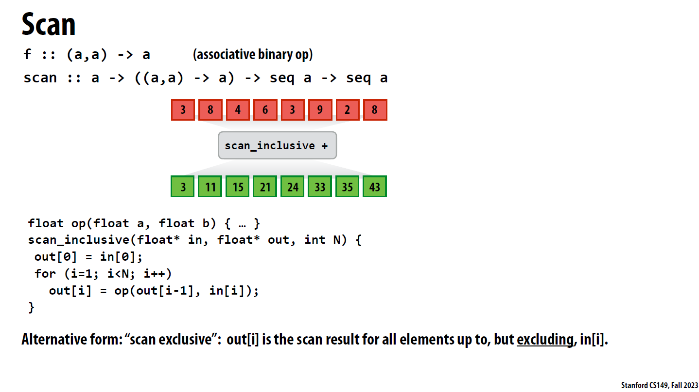
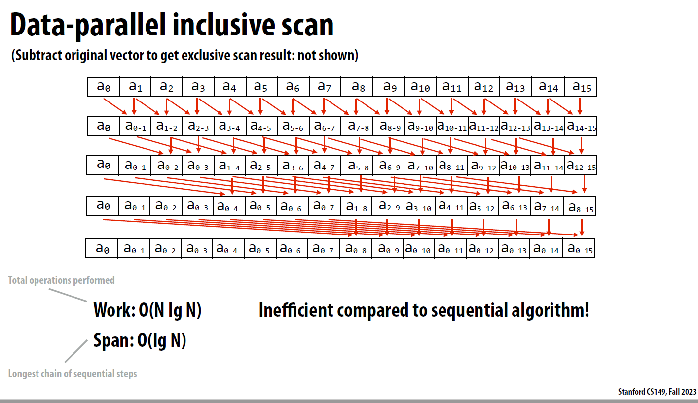
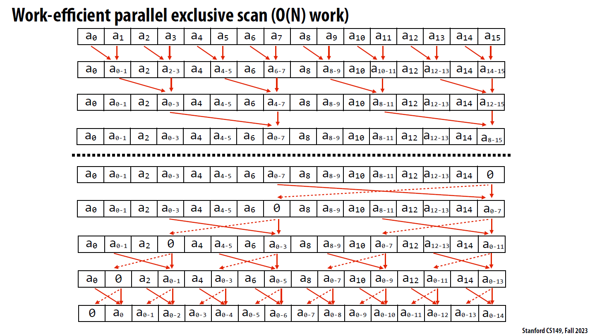
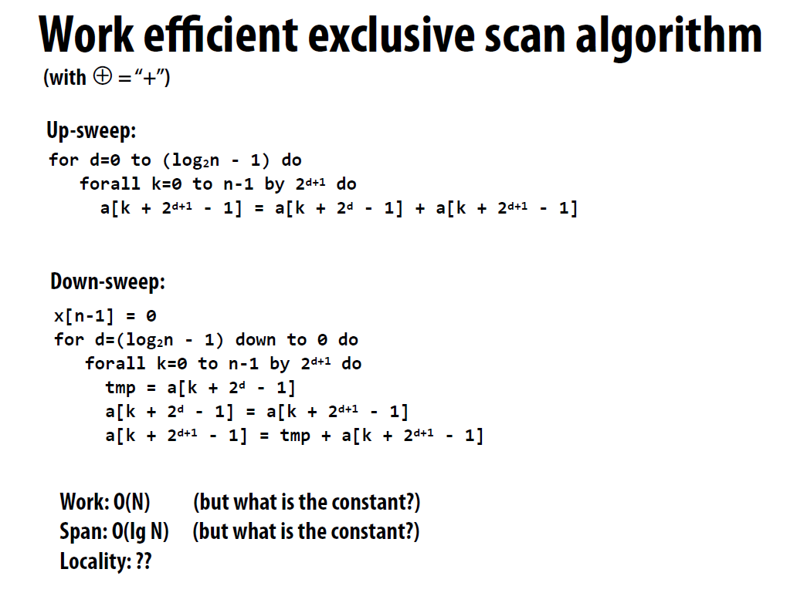
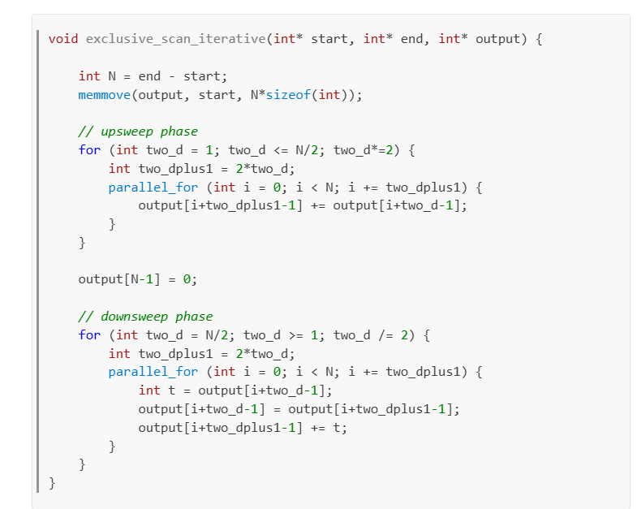

# scan与并行思考 - 其一

脱产之后又发现20块一餐实在是贵的钥匙。。实际上15块一餐我都不太能接受（属于是被学校10块钱不到的一餐惯坏了）

这期就记录一下GPU相关的，内容也就我看到的，以及做的作业的东西

- scan - 并行前缀和 √
- 以find_repeats为例的并行思考 TODO
- GPU全局访存的合并以提高效率 TODO

#### scan

输入一个数组a，输出数组prefix_sum。即它的前缀和。

scan又可以分类为inclusive和exclusive。顾名思义，exclusive就是直到它前一个元素为止的前缀和。如图

##### 时间复杂度与并行可行性分析

如上图我们知道它的时间复杂度为$O(n)$就是扫一遍。在并行算法中存在更优的时间复杂度方法，可以达到$O(logn)$

##### 并行思想

想象一下有很多个元素的数组，每个元素都被一个线程掌控（这里指的是cuda线程，具体请看cuda guide或cs149的gpu programming）

###### 思想1. 每个线程加它前面的一个元素（inclusive）

如图，每个线程在一轮中，都加上它前面的一个元素，下一轮就加前面的前面的，下一轮就加前面的前面的前面的。。。（注意在这一轮中，每个线程都要完成了自己的工作才能进入下一轮）

**分析：**图已经可以很清楚的表示关系了，这里就从时间复杂度的分析来看。我们对最后一个元素想一个朴素的前缀和，它需要加$a_1 .. a_{n-1}$...一个一个加的话就是$O(n)$的，在这个算法中，因为每一轮每个地方都会得到自己的部分和，在第二轮的时候，$t_n$加$t_{n-2}$的$t_{n-2}$已经是一个包含2个元素部分和的和。以此类推，下一个加法就是加的包含4个元素部分和。那么就是$1 + 2 + 4 + ... = n$，可以推知轮次为$O(log(n))$

**问题：**这里存在一个问题，就是每一轮都会启动$n$个线程，然后去做这样的加法。对比每个线程都做加法，这里又少了一部分。工作量是这样的：$\sum\limits_{i=0}^{log(n)-1} {n-2^i}  = nlogn - n$。这个工作量应该也算$O(NlgN)$，这个式子应该是比朴素前缀和的$n$工作量要大的。

- 工作量较大

吃个饭先。

感觉有点像之前公司楼下那个依旧贵的钥匙的面，以及预制汤的味道太熟悉了。

###### 思想2. 两次sweep方法的exclusive_scan

这个东西从图上来看有点看不出来，可以看一下课程给的伪代码

或者实验给的代码

两个过程如它们的名字一般，刚好是互逆的。

其过程大概是upsweep将整段二分，然后每段也可以递归二分。每段末尾存储自身这段的和。

那么算好之后，downsweep就可以合并这些段的部分和，以$a_{0-7}$为例，由于我们只需要exclusive_scan，所以左半段的这个位置不需要$a_{0-7}$，但是右半段需要，同时exclusive的第一个元素为0，且右半段最后一个是全数组的和也不需要，所以将最后一个0跟这个$a_{0-7}$交换。又因为其他的部分和都需要加上总段前半段的总和，所以就有不断地加和与交换了，最终让$a_{0-7}$归位到下标8的位置，右半段就算好了。（这里表述可能不是很准确，我好像也不能算完全理解为什么这么做，如果你有更好的表述欢迎在评论区补充！）

###### 时间复杂度与工作量分析

时间复杂度(span)：O(2*logn)，upsweep不取等，downsweep取等，所以应该是log(n)+log(n)-1

工作量：跟上一个的分析方法类似，注意downsweep的一次交换+求和操作是2个operator
$$
2+4+...(n/2) + (1+2+...+(n/2))*2 \\
= 3n / 2 - 4
$$

###### segmented scan

这个可以去看原视频和PPT，这里就不扩展了（）

#### 小结

本节我们学习了scan的用法。。疑似本人理解力和思考力有些许欠缺，望提出建议。

不过以并行思想思考还是挺难的，做多了单线程题目导致的。

下两期：对scatter加深理解的find_repeats、以及cuda手册中的合并访存为一个burst（这玩意居然之前学计组类似物的时候碰到过）